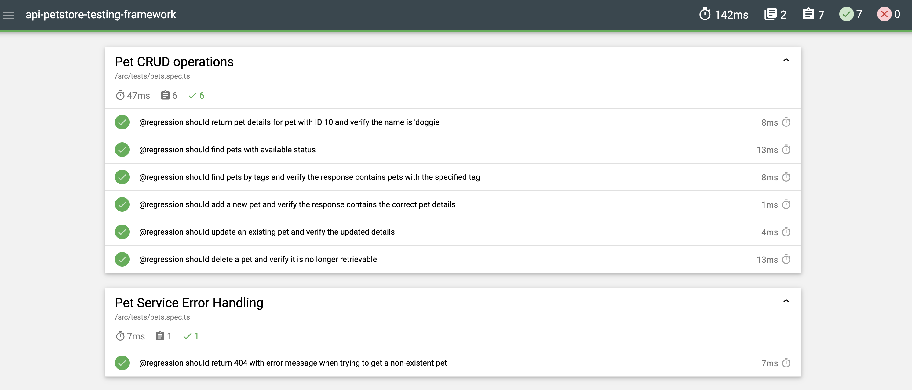

# PetStore API Testing Framework

A comprehensive testing framework for validating CRUD operations and endpoints of a PetStore API using Mocha, Chai, and Axios.

---

## 📖 Overview
This framework automates regression and functional testing for a PetStore API. It includes test cases for:
- Adding, updating, and deleting pets
- Fetching pets by ID, status, and tags
- Validating API responses and data integrity

Tests are isolated using `beforeEach` and `afterEach` hooks to ensure clean state management.

---

## 🛠 Technologies
- **Test Runner**: Mocha
- **Assertions**: Chai
- **HTTP Client**: Axios
- **Language**: TypeScript
- **Linting/Formatting**: ESLint, Prettier
- **Reporting**: Mochawesome

---

## 🚀 Setup

### Prerequisites
- Node.js (v18+ recommended)
- NPM
- Docker (optional for containerized execution)

### Installation
1. Clone the repository:
   ```bash
   git clone https://github.com/0xIslamTaha/api-petstore-testing-framework.git
   ```
2. Install dependencies:
   ```bash
   npm install
   ```

---

## 🧪 Running Tests

### Local Execution
| Command                     | Description                                  |
|-----------------------------|----------------------------------------------|
| `npm test`                  | Run all tests with Mochawesome reporting     |
| `npm run test:parallel`     | Run tests in parallel mode                   |
| `npm run regression`        | Run only tests tagged with `@regression`     |
| `npm run lint`              | Check code for linting errors                |
| `npm run lint:fix`          | Automatically fix linting issues             |
| `npm run prettify`          | Format code using Prettier                   |

### Local Execution
1. Ensure your API server is running on the host machine before executing tests.
2. Update the .evn file with the value of the BASE_URL
3. Run the test cases:
```bash
npm run test
```

### Docker Execution
1. Build the Docker image:
   ```bash
   docker build -t petstore-tests .
   ```
2. Run tests in a container (replace `<server_url>` with your API endpoint):
   ```bash
   docker run --rm -e BASE_URL=<server_url> petstore-tests
   ```

#### Example for macOS:
```bash
docker run --rm -e BASE_URL=http://host.docker.internal:8080/api/v3 petstore-tests
```

> **Note**:  
> - Ensure your API server is running on the host machine before executing tests.  
> - For non-macOS systems, adjust `BASE_URL` to match your local API endpoint (e.g., `http://0.0.0.0:8080/api/v3`).

---

## 📂 Project Structure
```
src/
├── services/           # API service layer (PetsService.ts)
├── models/             # Data models (PetsModel.ts)
├── base/               # Base service configuration (ServiceBase.ts)
├── helper/             # Utilities (e.g., random integer generator)
└── **/*.spec.ts        # Test specifications
```

---

## 🔍 Key Test Cases
1. **Pet CRUD Validation**  
   - Add a pet and verify response details.
   - Update a pet's name/status and confirm changes.
   - Delete a pet and ensure it becomes inaccessible.

2. **Search Functionality**  
   - Fetch pets by `status` (available/pending/sold).
   - Retrieve pets using tags and validate results.

3. **Negative Cases**  
   - Verify getting non-existing pet, retrieves 404 with an error message.


---

## ✨ Best Practices
- **Hooks**: `beforeEach` creates a fresh pet, and `afterEach` cleans up resources.
- **Tagging**: Tests are tagged with `@regression` for targeted execution.
- **Type Safety**: TypeScript interfaces enforce consistent data shapes.

---

## 📊 Reporting
Tests generate detailed HTML reports via `mochawesome-with-mocha`. Reports are saved in the `mochawesome-report` directory after running `npm test`.


### Sample Test Report

